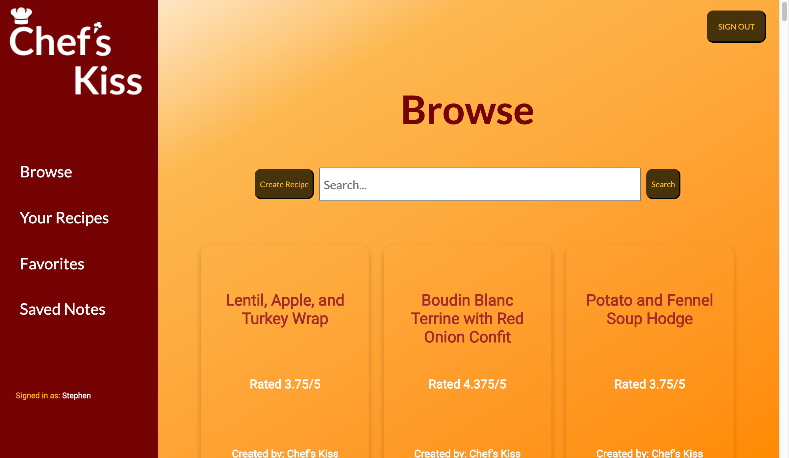

# Chef's Kiss

 * Team askew-elk: Stephen Crowe, James Tanner, Shikhar Sinha, Xiaoyi Wu
 * Prof. Pierson
 * CS61: Databases
 * 29 May 2020

Chef’s Kiss is your one-stop recipe shop! You can browse recipes when you’re looking to make something new, and you can also upload and save your own personal recipes to keep everything in one place.



## Dev Setup

### Requirements

API requirements

* Node >=9 <=11
* yarn (preferred over npm)

To install node on Mac:
```
brew update
brew upgrade
brew install node@10
brew install yarn
```

To check your installation of node and yarn:
```
node --version
yarn --version
```

To install on Windows, install from [nodejs.org](https://nodejs.org/en/) and [yarnpkg.com](https://classic.yarnpkg.com/en/).

### Install dependencies

Run the command `yarn` to install node modules.

### Start the server

`yarn start`

## Acknowledgements

Thanks to Prof. Tim Tregubov for equipping this repo with the following from his server starterpack:

* node with babel
* expressjs
* airbnb eslint rules

Procfile set up to run on [heroku](https://devcenter.heroku.com/articles/getting-started-with-nodejs#deploy-the-app)
